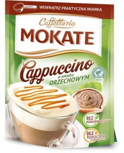
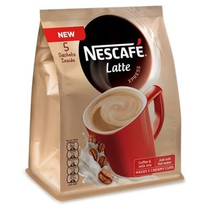
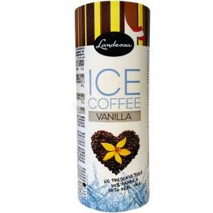
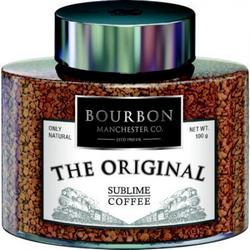

# mayulya
<!DOCTYPE html>
<html>
 <head>
  <meta http-equiv="Content-Type" content="text/html; charset=utf-8">
  <meta name="description" content="Интернет магазин кофейных напитков в г. Покровск">
  <meta name="robots" content="noindex, nofollow">
  <meta name="viewport" content="width=device-width, initial-scale=1">
  <meta name="keywords" content="купить кофе, чай, Покровск">
  <title>Магазин кофейных напитков "Кофеман"</title>
  <!-- Подключение таблицы стилей -->
  <link rel="stylesheet" type="text/css" href="style.css">
  
  <header>
   

   

  </header>
 </head>

 <body>
 
 	<header>
 	<!-- Меню страницы -->
	 

	<nav id="menu1">
		<ul>
			<li><a href="#m1">Главная</a></li>
			<li><a href="#m2">О нас</a></li>
			<li><a href="#m3">Каталог</a>
				<ul>
					<li><a href="comanda.html" target="_blank">Ассортимент кофейных напитков</a></li>
					<li><a href="#m3_2">Виды эспрессо</a></li>
					<li><a href="#m3_3">Виды американо</a></li>
					<li><a href="#m3_4">Виды латте</a></li>
					<li><a href="#m3_5">Виды каппучино</a></li>
				</ul>
			</li>
			<li><a href="#m4">Сорта</a></li>
			<li><a href="#m5">Бренды</a></li>
			<li><a href="#m5">Рецепты приготовления</a></li>
			<li><a href="#m5">Отзывы</a></li>
			<li><a href="#m5">Оплата и доставка</a></li>
		</ul>
	</nav>    
		

	</header>
	
	<!-- Плитка товаров -->
	

			<h1>Капучино</h1>
			
			

				Капучино — баланс вкуса кофе и молока. Это самый известный кофейный напиток на основе эспрессо. В нём сохраняется баланс: чувствуется вкус эспрессо, но он не преобладает над вкусом молока. Вес 500 гр.
			

			250 грн
			<button><b>КУПИТЬ</b></button>
		

			

			<h1>Латте</h1>
			
			

				 Latte - это купаж кофейных зерен, имеющих естественную сливочную мягкость вкуса и обжаренных по традиционному итальянскому рецепту. Напиток содержит высококачественные сухие сливки, позволяющие быстро приготовить превосходный итальянский кофе-латте - нежный, с густой ароматной пенкой. Вес 500 гр.
			

			150 грн
			<button><b>КУПИТЬ</b></button>
		

		

			<h1>Айс</h1>
			
			

				Ice Coffee - высококачественный кофе, созданный из отобранных вручную кофейных зерен. Зерна тщательно обжариваются, охлаждаются и перемалываются, что позволяет получить кофе в капсулах с неповторимым, богатым вкусом. Капсулы герметично запечатаны, что позволяет сохранить непревзойденный аромат кофейных зерен. Вес 500 гр.
			

			450 грн
			<button><b>КУПИТЬ</b></button>
		

		

			<h1>Бурбон</h1>
			
			

				Кофе Бурбон порадует истинных ценителей своим утонченным вкусом, также заметны приятные кислинка и мягкое сливочное послевкусие. Потребители останутся довольны оригинальным ароматом, наполняющим воздух пряной сладостью, что является характерной чертой напитка. Вес 500 гр.
			

			250 грн
			<button><b>КУПИТЬ</b></button>
		

 

   &copy; Кофейня "Кофеман" г.Покровск площадь Влюбленных сердец 0507528985 для заказа кофейных напитков с доставкой на дом
  

 </body>
</html>
